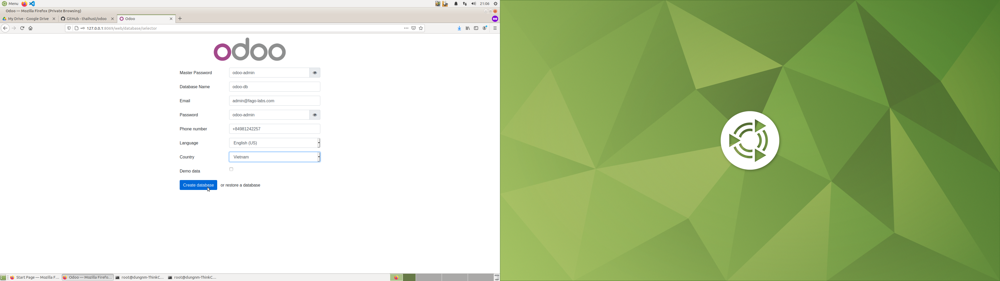

# Install odoo from binary
rm -rf addons config odoo-db-data odoo-web-data
mkdir -p addons config odoo-db-data odoo-web-data
chown -R 101:101 odoo-web-data
docker-compose -f odoo-from-binary.yml up -d

# Install odoo from source
## 1. Build docker
- Edit file `dockerfile/Dockerfile`, change variables:

```
OE_REPO: odoo source code repo
OE_VERSION: odoo branch
```

- Build image:

```
cd dockerfile
docker build -t odoo-from-source:14.0 .
```

## 2. Update odoo compose file
- Edit compose file `odoo.yml`, change image of service `odoo-web` to the image name built above

## 3. Update odoo-config
- Edit file: `config/odoo.conf`. Change variables:

```
admin_passwd: password to login odoo from web dashboard 
db_host: DB host
db_port: 5432
db_user: odoo-admin 
db_password: odoo-admin 
addons_path: /opt/odoo-admin/odoo/addons,/opt/odoo-admin/odoo-custom-addons
```

## 4. Run odoo

```
docker-compose -f odoo.yml up -d
```

## 5. Access odoo from web browser
- Access: http://127.0.0.1:8069
- Setup odoo for the first time as below:


